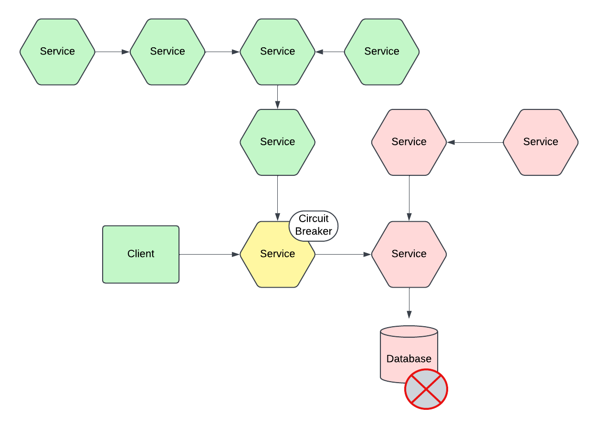

== Apache CXF Circuit Breaker

Scenario: Cascade service outage.

Solution: Fail fast, gracefully. Resume services, cautiously. Use a circuit breaker.

== Circuit Breaker Pattern

The key concepts of the circuit breaker is that one places service access under a management component. The circuit breaker then acts as a traffic officer, preventing a down stream service from getting calls it can not serve, while also immediately failing client calls as to not make them await results. This behavoir in a small scale application may appear to be over-kill, in larger systems this may act to prevent cascading failures.

In the above diagram the circuit breaker, when opened, prevents other services from potentially failing due resource exhaustion on the service side processing timeout requests from the client application seeking the data service.

=== CLOSED STATE

When all is well, the circuit breaker operates in CLOSED state - that is to say requests are routed to their service provider.

=== OPENED STATE

When requests to the service begin to fail, repeatedly the component at some configured threshold will OPEN the circuit, halting the flow of requests to the service (which reduces load on that service's host) and immediately returns an error response (no need to timeout a request thread, reducing caller resource usage).

=== HALF-OPEN STATE

When the circuit breaker is half-open, it will allow a small number of requests to proceed to the service - it monitors for their success. If the calls succeed, it may fully close the circuit to resume regular operation, otherwise it will re-open the circuit.

== How do we implement this in CXF?

We have provided in this post's repo a sample of JAX-WS and JAX-RS circuit break implementations.

=== Build

[,bash,num]
----
mvn clean install
----

=== Deploy

[,bash,num]
----
feature:repo-add cxf 3.5.5
feature:install aries-blueprint cxf-jaxws cxf-features-clustering
install -s wrap:mvn:org.codeartisans/org.json/20130213
install -s mvn:joda-time/joda-time/2.8.1
install -s mvn:org.qi4j.core/org.qi4j.core.functional/2.1
install -s mvn:org.qi4j.core/org.qi4j.core.api/2.1
install -s mvn:org.qi4j.core/org.qi4j.core.io/2.1
install -s mvn:org.qi4j.core/org.qi4j.core.spi/2.1
install -s mvn:org.qi4j.core/org.qi4j.core.bootstrap/2.1
install -s mvn:org.qi4j.library/org.qi4j.library.jmx/2.1
install -s mvn:org.qi4j.library/org.qi4j.library.circuitbreaker/2.1
install -s mvn:com.savoir.cxf.circuit.breaker.jaxws/gateway
install -s mvn:com.savoir.cxf.circuit.breaker.jaxws/client
----

To resolve CXF class loading issue, we append a Fragment - this is activated when CXF Clustering is refreshed.

[,bash,num]
----
install mvn:com.savoir.cxf.circuit.breaker.jaxws/fragment
refresh ${org.apache.cxf.cxf-rt-features-clustering-bundleId}
install mvn:com.savoir.cxf.circuit.breaker.jaxws/command
install mvn:com.savoir.cxf.circuit.breaker.jaxws/dataservice
----

Your Karaf should report the following bundles:
[,bash,num]
----
karaf@root()> list
START LEVEL 100 , List Threshold: 50
 ID │ State    │ Lvl │ Version        │ Name
────┼──────────┼─────┼────────────────┼───────────────────────────────────────────────
 33 │ Active   │  80 │ 4.4.6          │ Apache Karaf :: OSGi Services :: Event
115 │ Active   │  80 │ 0              │ wrap_mvn_org.codeartisans_org.json_20130213
116 │ Active   │  80 │ 2.8.1          │ Joda-Time
117 │ Active   │  80 │ 2.1            │ Apache Zest™ Functional
118 │ Active   │  80 │ 2.1            │ Apache Zest™ Core API
119 │ Active   │  80 │ 2.1            │ Apache Zest™ I/O
120 │ Active   │  80 │ 2.1            │ Apache Zest™ Core SPI
121 │ Active   │  80 │ 2.1            │ Apache Zest™ Core Bootstrap
122 │ Active   │  80 │ 2.1            │ Apache Zest™ Library - JMX
123 │ Active   │  80 │ 2.1            │ Apache Zest™ Library - Circuit Breaker
124 │ Active   │  80 │ 1.0.0.SNAPSHOT │ Circuit Breaker Demo :: JAX-WS :: gateway
125 │ Active   │  80 │ 1.0.0.SNAPSHOT │ Circuit Breaker Demo :: JAX-WS :: client
128 │ Resolved │  80 │ 1.0.0.SNAPSHOT │ Circuit Breaker Demo :: JAX-WS :: fragment, Hosts: 70
karaf@root()>
----

=== JAX-WS

[,xml,num]
----
<!-- other jaxws:client attributes and elements are omitted for brevity -->
<jaxws:client id="clientWithRandomFailoverSupport" address="http://localhost:8080/initialAddress">
   <jaxws:features>
       <clustering:circuit-breaker-failover threshold="1" timeout="60000">
            <clustering:strategy>
                <ref bean="RandomAddresses"/>
            </clustering:strategy>
        </clustering:circuit-breaker-failover>
   </jaxws:features>
</jaxws:client>
----

=== JAX-RS

[,xml,num]
----
<!-- other jaxrs:client attributes and elements are omitted for brevity -->
<jaxrs:client id="failoverRandom" address="http://localhost:8080/initialAddress">
    <jaxrs:features>
        <clustering:circuit-breaker-failover threshold="1" timeout="60000">
            <clustering:strategy>
                <ref bean="RandomAddresses"/>
            </clustering:strategy>
        </clustering:circuit-breaker-failover>
    </jaxrs:features>
</jaxrs:client>
----

== Conclusion

The circuit breaker pattern is an effective way to provide fault tolerance in a distributed services architecture. The small overhead of monitoring traffic through services is out weighed by the benefit of preventing cascade failures. This pattern in of itself is not panacea, timeouts, retry, failover, and other patterns should be implemented in an overall plan towards fault tolerance in your architecture.

== About the Authors

link:https://github.com/savoirtech/blogs/blob/main/authors/JamieGoodyear.md[Jamie Goodyear]

== Reaching Out

Please do not hesitate to reach out with questions and comments, here on the Blog, or through the Savoir Technologies website at https://www.savoirtech.com.

== With Thanks

Thank you to the Apache CXF community.

(c) 2024 Savoir Technologies
